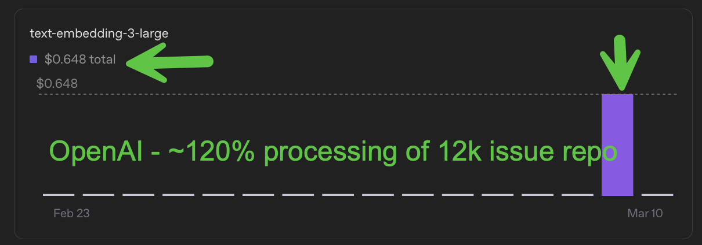

# ghcrawl

[](https://github.com/pwrdrvr/ghcrawl/actions/workflows/ci.yml)
[](https://www.npmjs.com/package/ghcrawl)
[](https://www.npmjs.com/package/ghcrawl)
[](./LICENSE)

`ghcrawl` is a local-first GitHub issue and pull request crawler for maintainers.


## Install

Install the published CLI package:

```bash
npm install -g ghcrawl
```

That package exposes the `ghcrawl` command directly.

If you are working from source or maintaining the repo, use [CONTRIBUTING.md](./CONTRIBUTING.md).

## Requirements

Normal `ghcrawl` use needs both:

- a GitHub personal access token
- an OpenAI API key

GitHub is required to crawl issue and PR data. OpenAI is required for embeddings and the maintainer clustering and search workflow. If you already have a populated local DB you can still browse it without live keys, but a fresh `sync` + `embed` + `cluster` or `refresh` run needs both.

## Quick Start

```bash
ghcrawl init
ghcrawl doctor
ghcrawl refresh owner/repo
ghcrawl tui owner/repo
```

`ghcrawl init` runs the setup wizard. It can either:

- save plaintext keys in `~/.config/ghcrawl/config.json`
- or guide you through a 1Password CLI (`op`) setup that keeps keys out of the config file

## Typical Commands

```bash
ghcrawl doctor
ghcrawl sync owner/repo --since 7d
ghcrawl refresh owner/repo
ghcrawl embed owner/repo
ghcrawl cluster owner/repo
ghcrawl clusters owner/repo --min-size 10 --limit 20
ghcrawl cluster-detail owner/repo --id 123
ghcrawl search owner/repo --query "download stalls"
ghcrawl tui owner/repo
ghcrawl serve
```

### Embed Command Example

```bash
ghcrawl embed owner/repo
```

<video src="./docs/images/ghcrawl-embed.mp4" controls muted playsinline></video>

If your Markdown renderer does not show the video inline, open [ghcrawl-embed.mp4](./docs/images/ghcrawl-embed.mp4) directly.

## Init And Doctor

First run:

```bash
ghcrawl init
ghcrawl doctor
```

`init` behavior:

- prompts you to choose one of two secret-storage modes:
  - `plaintext`: saves both keys to `~/.config/ghcrawl/config.json`
  - `1Password CLI`: stores only vault and item metadata and tells you how to run `ghcrawl` through `op`
- if you choose plaintext storage, init warns that anyone who can read that file can use your keys and that resulting API charges are your responsibility
- if you choose 1Password CLI mode, init tells you to create a Secure Note with concealed fields named:
  - `GITHUB_TOKEN`
  - `OPENAI_API_KEY`

GitHub token guidance:

- recommended: fine-grained PAT scoped to the repositories you want to crawl
- repository permissions:
  - `Metadata: Read-only`
  - `Issues: Read-only`
  - `Pull requests: Read-only`
- if you use a classic PAT and need private repositories, `repo` is the safe fallback scope

`doctor` checks:

- config file presence and path
- local DB path wiring
- GitHub token presence, token-shape validation, and a live auth smoke check
- OpenAI key presence, key-shape validation, and a live auth smoke check
- if init is configured for 1Password CLI but you forgot to run through your `op` wrapper, doctor tells you that explicitly

### 1Password CLI Example

If you choose 1Password CLI mode, init shows a `~/.zshrc` helper like this:

```bash
ghcrawl-op() {
  env GITHUB_TOKEN="$(op read 'op://Private/ghcrawl/GITHUB_TOKEN')" \
      OPENAI_API_KEY="$(op read 'op://Private/ghcrawl/OPENAI_API_KEY')" \
      ghcrawl "$@"
}
```

Then use:

```bash
ghcrawl-op doctor
ghcrawl-op tui
ghcrawl-op sync owner/repo
```

## Cost To Operate

The main variable cost is OpenAI embeddings.

On a real local run against roughly `12k` issues plus about `1.2x` related PR and issue inputs, `text-embedding-3-large` came out to about **$0.65 USD** total to embed the repo. Treat that as an approximate data point for something like `~14k` issue and PR inputs, not a hard guarantee.

This screenshot is the reference point for that estimate:



## Agent Skill

This repo ships an installable skill at [skills/ghcrawl/SKILL.md](./skills/ghcrawl/SKILL.md).

For installation and usage conventions, point users at [vercel-labs/skills](https://github.com/vercel-labs/skills).

The skill is built around the stable JSON CLI surface:

```bash
ghcrawl doctor --json
ghcrawl refresh owner/repo
ghcrawl clusters owner/repo --min-size 10 --limit 20 --sort recent
ghcrawl cluster-detail owner/repo --id 123 --member-limit 20 --body-chars 280
```

The agent and build contract for this repo lives in [SPEC.md](./SPEC.md).

## Current Caveats

- `serve` starts the local HTTP API only. The web UI is not built yet.
- `sync` only pulls open issues and PRs.
- a plain `sync owner/repo` is incremental by default after the first full completed open scan for that repo
- `sync` is metadata-only by default
- `sync --include-comments` enables issue comments, PR reviews, and review comments for deeper context
- `embed` defaults to `text-embedding-3-large`
- `embed` generates separate vectors for `title` and `body`, and also uses stored summary text when present
- `embed` stores an input hash per source kind and will not resubmit unchanged text for re-embedding
- `sync --since` accepts ISO timestamps and relative durations like `15m`, `2h`, `7d`, and `1mo`
- `sync --limit <count>` is the best smoke-test path on a busy repository
- `tui` remembers sort order and min cluster size per repository in the persisted config file
- if you add a brand-new repo from the TUI with `p`, ghcrawl runs sync -> embed -> cluster and opens that repo with min cluster size `1+`

## Responsibility Attestation

By operating `ghcrawl`, you accept that you, and any employer or organization you operate it for, are fully responsible for:

- obtaining GitHub and OpenAI API keys through legitimate means
- monitoring that your use of this tool complies with the agreements, usage terms, and platform policies that apply to those keys
- storing those API keys securely
- any misuse, theft, unexpected charges, or other consequences resulting from those keys being exposed or abused
- monitoring spend and stopping or reconfiguring the tool if usage is higher than you intended

The creators and contributors of `ghcrawl` accept no liability for API charges, account actions, policy violations, data loss, or misuse resulting from operation of this tool.
