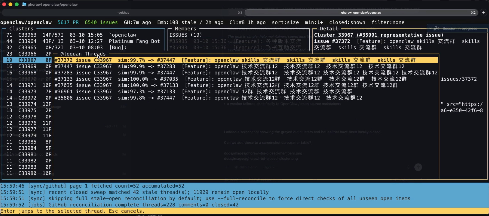
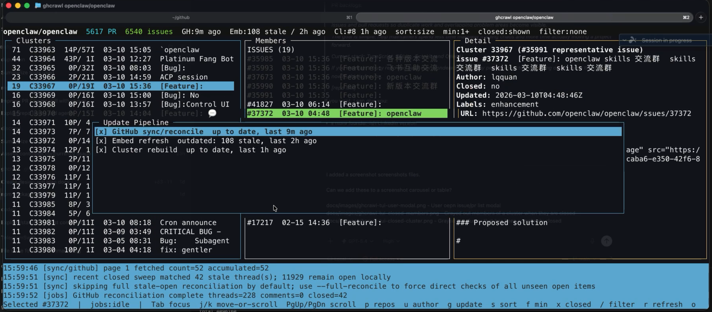
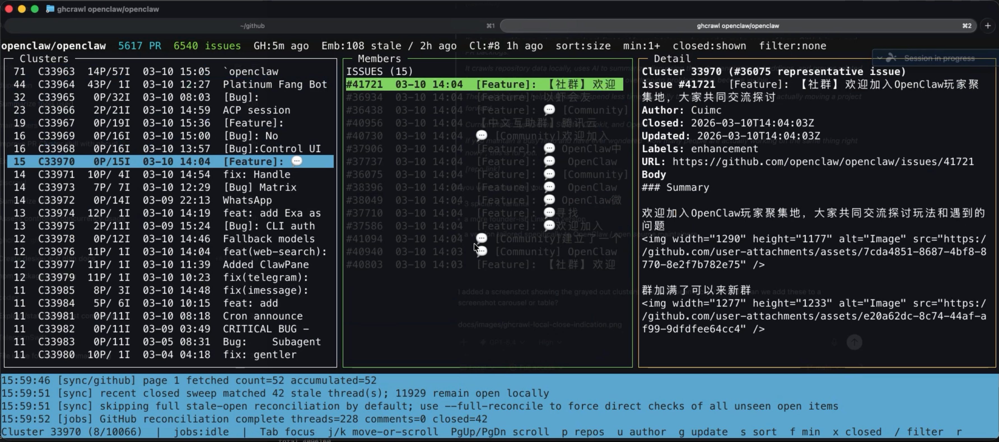
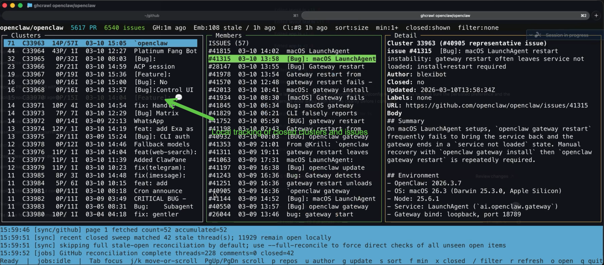

# ghcrawl

[](https://github.com/pwrdrvr/ghcrawl/actions/workflows/ci.yml)
[](https://www.npmjs.com/package/ghcrawl)
[](https://www.npmjs.com/package/ghcrawl)
[](./LICENSE)

`ghcrawl` is a local-first GitHub issue and pull request crawler for maintainers.


## Install

Install the published CLI package:

```bash
npm install -g ghcrawl
```

That package exposes the `ghcrawl` command directly.

If you are working from source or maintaining the repo, use [CONTRIBUTING.md](./CONTRIBUTING.md).

## Requirements

Normal `ghcrawl` use needs both:

- a GitHub personal access token
- an OpenAI API key

GitHub is required to crawl issue and PR data. OpenAI is required for embeddings and the maintainer clustering and search workflow. If you already have a populated local DB you can still browse it without live keys, but a fresh `sync` + `embed` + `cluster` or `refresh` run needs both.

## Quick Start

```bash
ghcrawl init
ghcrawl configure
ghcrawl doctor
ghcrawl refresh owner/repo
ghcrawl tui owner/repo
```

`ghcrawl init` runs the setup wizard. It can either:

- save plaintext keys in `~/.config/ghcrawl/config.json`
- or guide you through a 1Password CLI (`op`) setup that keeps keys out of the config file

`ghcrawl refresh owner/repo` is the main pipeline command. It pulls the latest open GitHub issues and pull requests, summarizes changed items only when the active embedding basis depends on summaries, refreshes vectors, and rebuilds the clusters you browse in the TUI.

## One-Time Migration

Upgrading to this release changes the local vector and cluster pipeline:

- vectors now use a persistent `vectorlite` sidecar index
- the active vector is one vector per open thread
- old multi-row `document_embeddings` are removed after the first successful rebuild

For an existing repo, the one-time migration command is:

```bash
ghcrawl refresh owner/repo
```

Important notes:

- `refresh` performs the migration; plain `sync` does not
- with the default `title_original` basis, the migration rebuilds vectors and clusters without running LLM summaries
- if you switch to `title_summary`, `refresh` also runs the summarize step before embedding
- after the first successful migration refresh, ghcrawl removes legacy embeddings, compacts the local DB, and rebuilds clusters from the current vectors

## Typical Commands

```bash
ghcrawl configure
ghcrawl doctor
ghcrawl refresh owner/repo
ghcrawl tui owner/repo
```

`refresh`, `sync`, and `embed` call remote services and should be run intentionally.

`cluster` does not call remote services, but it is still time consuming. It now uses a persistent `vectorlite` index instead of exact in-memory scans, so large-repo rebuilds are materially faster, but still not instant.

`clusters` explores the clusters already stored in the local SQLite database and is expected to be the fast, read-only inspection path.

## CLI Help And Machine Output

Every public command now supports both:

```bash
ghcrawl help refresh
ghcrawl refresh --help
```

For agent-facing and script-facing commands, prefer explicit machine mode:

```bash
ghcrawl configure --json
ghcrawl doctor --json
ghcrawl threads owner/repo --numbers 42,43,44 --json
ghcrawl clusters owner/repo --min-size 10 --limit 20 --sort recent --json
```

Contract notes:

- `doctor` keeps a human-readable TTY default unless you pass `--json`
- JSON-oriented commands accept `--json` explicitly; current JSON-by-default behavior is still available as a compatibility path
- machine payloads are written to `stdout`
- progress logs and error messages are written to `stderr`
- use `--config-path <path>` to force a specific persisted config file
- use `--workspace-root <path>` to force `.env.local` and workspace-local DB discovery

### Refresh Command Example

```bash
ghcrawl refresh owner/repo
```


### TUI Screenshots

| User open issue/PR list modal | Refresh modal |
| --- | --- |
|  |  |
| Press `u` to open the current user's issue and PR list modal. | Press `g` to open the GitHub/embed/cluster refresh modal. |

| Closed members in a cluster | Fully closed cluster |
| --- | --- |
|  |  |
| Closed members stay visible in gray so overlap is still easy to inspect. | A cluster with no open members is grayed out as a whole until you hide closed items. |


Press `l` on wide screens to toggle the stacked layout with the cluster list on the left and members/detail stacked on the right.

## Controlling The Refresh Flow More Intentionally

Most users should run `ghcrawl refresh owner/repo` and let it do the full pipeline in the right order.

If you need tighter control, you can run the three stages yourself:

```bash
ghcrawl sync owner/repo     # pull the latest open issues and pull requests from GitHub
ghcrawl summarize owner/repo  # optional explicit summary refresh when using title_summary
ghcrawl embed owner/repo    # generate or refresh the single active vector per thread
ghcrawl cluster owner/repo  # rebuild local related-work clusters from the current vectors (local-only, but can take ~10 minutes on a ~12k issue/PR repo)
```

Run them in that order. If your embedding basis is `title_summary`, `refresh` automatically inserts the summarize stage before embed for you. With the default `title_original` basis, `refresh` does not summarize unless you run `summarize` explicitly.

## Init And Doctor

First run:

```bash
ghcrawl init
ghcrawl doctor
```

`init` behavior:

- prompts you to choose one of two secret-storage modes:
  - `plaintext`: saves both keys to `~/.config/ghcrawl/config.json`
  - `1Password CLI`: stores only vault and item metadata and tells you how to run `ghcrawl` through `op`
- if you choose plaintext storage, init warns that anyone who can read that file can use your keys and that resulting API charges are your responsibility
- if you choose 1Password CLI mode, init tells you to create a Secure Note with concealed fields named:
  - `GITHUB_TOKEN`
  - `OPENAI_API_KEY`

GitHub token guidance:

- recommended: fine-grained PAT scoped to the repositories you want to crawl
- repository permissions:
  - `Metadata: Read-only`
  - `Issues: Read-only`
  - `Pull requests: Read-only`
- if you use a classic PAT and need private repositories, `repo` is the safe fallback scope

`doctor` checks:

- config file presence and path
- local DB path wiring
- GitHub token presence, token-shape validation, and a live auth smoke check
- OpenAI key presence, key-shape validation, and a live auth smoke check
- `vectorlite` runtime readiness
- if init is configured for 1Password CLI but you forgot to run through your `op` wrapper, doctor tells you that explicitly

## Configure

Use `configure` to inspect or change the active summary model and embedding basis:

```bash
ghcrawl configure
ghcrawl configure --summary-model gpt-5.4-mini
ghcrawl configure --embedding-basis title_original
```

Current defaults:

- summary model: `gpt-5-mini`
- embedding basis: `title_original` (`title + original body`)
- vector backend: `vectorlite`

Changing the summary model or embedding basis makes the next `refresh` rebuild vectors and clusters for that repo.

If you opt into `title_summary`, ghcrawl summarizes before embedding and uses `title + dedupe summary` as the active vector text. On `openclaw/openclaw`, that improved non-solo cluster membership by about 50% versus `title_original`, but it adds OpenAI spend. A first summarize of roughly `18k` open issues and PRs in that repo typically costs about `$15-$30` with `gpt-5-mini`; later refreshes are usually much cheaper because only changed items need summaries.

### 1Password CLI Example

If you choose 1Password CLI mode, create a 1Password Secure Note with concealed fields named exactly:

- `GITHUB_TOKEN`
- `OPENAI_API_KEY`

Then add this wrapper to `~/.zshrc`:

```bash
ghcrawl-op() {
  env GITHUB_TOKEN="$(op read 'op://Private/ghcrawl/GITHUB_TOKEN')" \
      OPENAI_API_KEY="$(op read 'op://Private/ghcrawl/OPENAI_API_KEY')" \
      ghcrawl "$@"
}
```

Then use:

```bash
ghcrawl-op doctor
ghcrawl-op refresh owner/repo
ghcrawl-op tui owner/repo
```

## Using The CLI To Extract JSON Data

These commands are intended more for scripts, bots, and agent integrations than for normal day-to-day terminal browsing:

```bash
ghcrawl threads owner/repo --numbers 42,43,44 --json
ghcrawl threads owner/repo --numbers 42,43,44 --include-closed --json
ghcrawl author owner/repo --login lqquan --json
ghcrawl close-thread owner/repo --number 42 --json
ghcrawl close-cluster owner/repo --id 123 --json
ghcrawl clusters owner/repo --min-size 10 --limit 20 --json
ghcrawl clusters owner/repo --min-size 10 --limit 20 --include-closed --json
ghcrawl durable-clusters owner/repo --member-limit 10 --json
ghcrawl cluster-detail owner/repo --id 123 --json
ghcrawl cluster-detail owner/repo --id 123 --include-closed --json
ghcrawl cluster-explain owner/repo --id 123 --member-limit 20 --event-limit 50 --json
ghcrawl search owner/repo --query "download stalls" --json
```

Use `threads --numbers ...` when you want several specific issue or PR records in one CLI call instead of paying process startup overhead repeatedly.

Use `author --login ...` when you want all currently open issue/PR records from one user plus the strongest stored same-author similarity match for each item.

By default, JSON list commands filter out locally closed issues/PRs and completely closed clusters. Use `--include-closed` when you need to inspect those records too.

Use `close-thread` when you know a local issue/PR should be treated as closed before the next GitHub sync catches up. If that was the last open item in its cluster, `ghcrawl` automatically marks the cluster closed too.

Use `close-cluster` when you want to locally suppress a whole cluster from default JSON exploration without waiting for a rebuild.

## Durable Cluster Governance

The durable cluster commands operate on stable cluster identities, not one-off run snapshots:

```bash
ghcrawl durable-clusters owner/repo --member-limit 10 --json
ghcrawl cluster-explain owner/repo --id 123 --json
ghcrawl exclude-cluster-member owner/repo --id 123 --number 42 --reason "false positive" --json
ghcrawl include-cluster-member owner/repo --id 123 --number 42 --reason "same root cause" --json
ghcrawl set-cluster-canonical owner/repo --id 123 --number 42 --reason "best root issue" --json
ghcrawl merge-clusters owner/repo --source 123 --target 456 --reason "same incident" --json
ghcrawl split-cluster owner/repo --source 123 --numbers 42,43 --reason "separate root cause" --json
ghcrawl cluster owner/repo --number 42 --json
```

Use `cluster-explain` when you need to answer why a durable cluster exists. It returns the stable slug, aliases, governed memberships, overrides, event history, and pairwise evidence sources such as deterministic fingerprints, hunk overlap, and vector-backed edges.

Maintainer overrides are sticky. If you exclude a thread from a durable cluster, future clustering records that decision and will not silently re-add it to the same cluster. `cluster --number` refreshes only one durable neighborhood, which is the cheaper path after a small sync or a manual governance edit.

## Cost To Operate

The main variable costs are summarization and embeddings. Embedding pricing is published by OpenAI here: [OpenAI API pricing](https://developers.openai.com/api/docs/pricing#embeddings).

On a real local run against roughly `12k` issues plus about `1.2x` related PR and issue inputs, [`text-embedding-3-large`](https://developers.openai.com/api/docs/pricing#embeddings) came out to about **$0.65 USD** total to embed the repo. Treat that as an approximate data point for something like `~14k` issue and PR inputs, not a hard guarantee.

For one-time summary migration planning on a repo around the size of `openclaw/openclaw` (`~20k` issues and PRs), `ghcrawl configure` reports these operator estimates using the April 1, 2026 USD pricing assumptions for this release:

- `gpt-5-mini`: about **$12 USD** one time
- `gpt-5.4-mini`: about **$30 USD** one time

`gpt-5-mini` is the default to keep that migration cost lower. `gpt-5.4-mini` is available when you want higher-quality summaries and are comfortable with the higher one-time spend.

This screenshot is the reference point for that estimate:


## Agent Skill

This repo ships an installable skill at [skills/ghcrawl/SKILL.md](./skills/ghcrawl/SKILL.md).

For installation and usage conventions, point users at [vercel-labs/skills](https://github.com/vercel-labs/skills).

Install the CLI first, then install the skill:

```bash
npm i -g ghcrawl
npx skills add -g pwrdrvr/ghcrawl
```

The skill is built around the stable JSON CLI surface and is intentionally conservative:

- default mode assumes no valid API keys and stays read-only
- API-backed operations only become available after `ghcrawl doctor --json` shows healthy auth
- even then, `refresh`, `sync`, `embed`, and `cluster` should only run when the user explicitly asks for them
- JSON list commands hide locally closed issues/PRs and closed clusters by default unless `--include-closed` is passed

```bash
ghcrawl doctor --json
ghcrawl refresh owner/repo
ghcrawl threads owner/repo --numbers 42,43,44 --json
ghcrawl clusters owner/repo --min-size 10 --limit 20 --sort recent --json
ghcrawl cluster-detail owner/repo --id 123 --member-limit 20 --body-chars 280 --json
ghcrawl cluster-explain owner/repo --id 123 --member-limit 20 --event-limit 50 --json
```

### Video Walkthrough

[](https://www.youtube.com/watch?v=xqgDcy3WDUI)

GitHub README links cannot force a new tab, but clicking the preview above will open the YouTube walkthrough from the repo page.

The agent and build contract for this repo lives in [SPEC.md](./SPEC.md).

## Current Caveats

- `serve` starts the local HTTP API only. The web UI is not built yet.
- `sync` only pulls open issues and PRs.
- a plain `sync owner/repo` is incremental by default after the first full completed open scan for that repo
- `sync` is metadata-only by default
- `sync --include-comments` enables issue comments, PR reviews, and review comments for deeper context
- `embed` defaults to `text-embedding-3-large` with `dimensions=1024`
- `embed` maintains one active vector per thread, stored in a persistent `vectorlite` sidecar index
- `embed` stores an input hash per thread and will not resubmit unchanged text for re-embedding
- the default embedding basis is `title + original body`; use `ghcrawl configure --embedding-basis title_summary` if you want to summarize before embedding
- `sync --since` accepts ISO timestamps and relative durations like `15m`, `2h`, `7d`, and `1mo`
- `sync --limit <count>` is the best smoke-test path on a busy repository
- `tui` remembers sort order and min cluster size per repository in the persisted config file
- the TUI shows locally closed threads and clusters in gray; press `x` to hide or show them
- on wide screens, press `l` to toggle between three columns and a wider cluster list with members/detail stacked on the right
- if you add a brand-new repo from the TUI with `p`, ghcrawl runs sync -> summarize-if-needed -> embed -> cluster and opens that repo with min cluster size `1+`

## Responsibility Attestation

By operating `ghcrawl`, you accept that you, and any employer or organization you operate it for, are fully responsible for:

- obtaining GitHub and OpenAI API keys through legitimate means
- monitoring that your use of this tool complies with the agreements, usage terms, and platform policies that apply to those keys
- storing those API keys securely
- any misuse, theft, unexpected charges, or other consequences resulting from those keys being exposed or abused
- monitoring spend and stopping or reconfiguring the tool if usage is higher than you intended

The creators and contributors of `ghcrawl` accept no liability for API charges, account actions, policy violations, data loss, or misuse resulting from operation of this tool.
