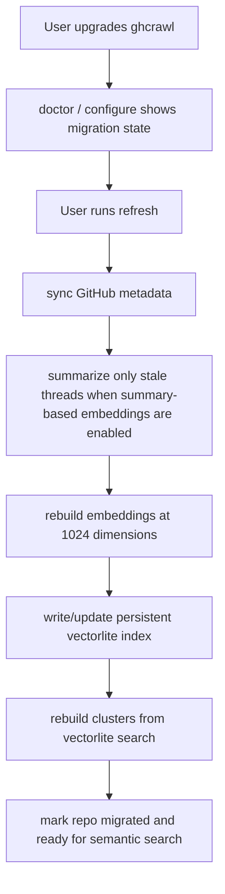

# Vectorlite Default Search And Summary Migration

## Problem Frame

`ghcrawl` currently treats `vectorlite` as an experiment, keeps embeddings in `document_embeddings.embedding_json`, and rebuilds clusters from in-memory exact similarity logic. That creates three problems:

1. Clustering and semantic lookups do not scale cleanly as repos grow past 10k-20k issues/PRs.
2. The product does not yet have a persistent ANN index that can answer semantic search or cluster-membership questions quickly for day-to-day use.
3. The current embedding/summarization pipeline is not versioned strongly enough to support a deliberate migration to shorter embeddings, a persistent vector index, and user-selectable summary models without confusion about what is stale.

The release needs to move `ghcrawl` to a persistent `vectorlite`-backed search model, migrate embeddings to 1024-dimensional `text-embedding-3-large`, preserve summary-skip behavior for unchanged inputs, and make the operator experience clear about cost, migration state, and rebuild behavior.

## Requirements

**Release Structure**
- R1. Ship this as a single coordinated breaking release rather than splitting it across three releases.
- R2. Treat `vectorlite` as a runtime requirement for supported installs in this release, not an experiment-only optional dependency.
- R3. Promote vector-backed semantic search and clustering to the supported default path for day-to-day operation.

**Persistent Vector Search**
- R4. `ghcrawl` must maintain a persistent `vectorlite`-backed vector index for each repository so semantic lookup does not require loading the full embedding corpus into memory.
- R5. Semantic search must query the persistent vector index directly rather than the current exact in-memory scan path.
- R6. The product must support fast “find likely cluster membership / nearest neighbors for a newly synced thread” using the persistent vector index.
- R7. The release must define one supported persistence strategy for the vector index and keep it stable for the release. The recommended default is a managed sidecar index or sidecar SQLite store rather than storing `vectorlite` virtual tables in the canonical issue/PR database.

**Summarization And Embedding Pipeline**
- R8. The release must support two summarization models for operator choice:
  - `gpt-5-mini`
  - `gpt-5.4-mini`
- R9. The default summarization model for new and upgraded installs must be `gpt-5-mini`.
- R10. The release must continue skipping summarization work when the summary input has not changed, and automated tests must prove this behavior.
- R11. The release must move embeddings to `text-embedding-3-large` with explicit `dimensions=1024`.
- R12. The release must store only one active embedding per thread for the active embedding basis, not multiple long-lived parallel embedding sources for old and new strategies.
- R13. The active embedding basis must be operator-selectable between:
  - title + original description
  - title + summarized description
- R14. The default embedding basis for this release should be title + summarized description because recent repo experiments indicate better clustering quality from the dedupe-summary path.
- R15. The stored embedding metadata must record the embedding basis and pipeline version used to create it so stale rows can be detected deterministically after config or model changes.
- R16. If the operator changes summarization model or embedding basis, `ghcrawl` must mark the affected summaries and/or embeddings stale instead of silently treating old data as current.

**Refresh And Migration Behavior**
- R17. The first `refresh` after upgrade must detect that pre-release embeddings are obsolete and rebuild embeddings before vector search and clustering are treated as current.
- R18. If the active embedding basis depends on summaries, `refresh` must become summary-aware and run a summarize phase before embedding whenever the relevant summary content is missing or stale.
- R19. Existing cluster runs built from pre-migration embeddings must be treated as stale after upgrade and must not continue to appear as if they are current once the repo is known to need migration.
- R20. The operator experience must make migration status obvious before and during the first post-upgrade rebuild.
- R21. Rebuild behavior must be repository-scoped, so one repo can complete migration without forcing all repos to migrate immediately.
- R22. If a repo has not completed the required rebuild yet, commands that depend on current vectors or current clusters must say so clearly instead of returning misleading old results.

**Operator Controls And UX**
- R23. Add a first-class `configure` command that shows the selected summarization model, embedding basis, vector backend status, and whether the current repo data is migrated or stale.
- R24. `configure` must allow the operator to switch summarization models intentionally.
- R25. The operator-facing docs and CLI help must explain that `gpt-5-mini` is the cheaper default and `gpt-5.4-mini` is the higher-quality, more expensive option.
- R26. `doctor` should report whether `vectorlite` loads successfully on the current machine, because this release makes it a supported runtime dependency.

**Cost And Spend Transparency**
- R27. The docs must include an estimate, using April 1, 2026 USD pricing, for summarizing roughly 20k `openclaw/openclaw` issues/PRs with both supported summary models.
- R28. The release should communicate that a one-time full summarize of ~20k threads is expected to cost roughly:
  - about `$30` with `gpt-5.4-mini`
  - about `$11-$13` with `gpt-5-mini`
  based on current OpenAI pricing and the repo’s observed token profile.
- R29. Long-running summarize/refresh progress output should continue reporting spend and estimated total cost so operators can stop early if needed.

**Validation And Release Safety**
- R30. Tests must prove summary skipping still works when thread input is unchanged after this migration.
- R31. Tests must prove stale detection for summary model changes, embedding basis changes, and pre-migration embeddings.
- R32. Tests must prove semantic search uses the persistent vector index successfully after migration.
- R33. Release verification must include upgrade testing from a pre-vectorlite database to the new release on at least one realistic repo dataset.
- R34. Release verification must include packaging/install validation for the supported desktop/server platforms because `vectorlite` becomes a hard dependency.

## Success Criteria
- Operators can upgrade and complete the first repo migration with a normal `refresh` flow instead of manually orchestrating summarize/embed/cluster recovery steps.
- Large repos no longer require loading the full embedding corpus into RAM for normal semantic lookup or cluster rebuild workflows.
- Semantic search and cluster-neighbor lookup are fast enough to feel interactive on migrated repos.
- Unchanged threads are not re-summarized on repeated refreshes.
- Docs and CLI clearly communicate model choice, migration status, and likely one-time spend before operators trigger a full rebuild.

## Scope Boundaries
- Not in scope for this release: keeping exact in-memory search as a co-equal supported production path.
- Not in scope for this release: shipping three separate rollout releases for vector backend, embedding migration, and summary model controls.
- Not in scope for this release: introducing a web UI as part of the migration.
- Not in scope for this release: preserving old cluster results as “current” after the release knows the repo must be re-embedded.

## Key Decisions
- One coordinated breaking release: The migration behavior is too coupled across vectors, summaries, search, and clustering to justify stretching it across three separate releases.
- `vectorlite` is a real dependency now: the release should treat it as supported runtime infrastructure, not an experiment hiding behind a side command.
- Default summary model is `gpt-5-mini`: it keeps the out-of-the-box one-time migration cost materially lower while preserving a higher-quality paid-up option.
- Default embedding basis is title + summarized description: recent repo experiments indicate this produces cleaner clusters than title/body alone.
- Existing summary skip behavior stays: the release should migrate the pipeline without turning `refresh` into an always-re-summarize money sink.

## Dependencies / Assumptions
- The supported `vectorlite` packaging story is good enough on the platforms `ghcrawl` intends to support in this release.
- OpenAI pricing as of April 1, 2026 remains:
  - `gpt-5-mini`: $0.25 / 1M input, $0.025 / 1M cached input, $2.00 / 1M output
  - `gpt-5.4-mini`: $0.75 / 1M input, $0.075 / 1M cached input, $4.50 / 1M output
- The recent repo experiment result in `docs/solutions/performance-issues/clustering-vectorlite-hnsw-embedding-optimization-2026-03-30.md` remains directionally valid for the release default.

## Outstanding Questions

### Deferred To Planning
- [Affects R7][Technical] Should the persistent vector index live in a sidecar SQLite DB, a sidecar vector index file, or inside the primary DB schema with `vectorlite` virtual tables?
- [Affects R18][Technical] How should `refresh` expose the new summarize-aware phase in progress output and skip flags without making the CLI surface confusing?
- [Affects R19][Technical] What is the cleanest way to mark old cluster runs invalid after upgrade while still letting the app explain why clusters are unavailable?
- [Affects R23][Technical] Should `configure` remain fully interactive, accept flags for non-interactive use, or support both?
- [Affects R31][Needs research] What is the smallest durable pipeline-versioning scheme that covers summary model, summary prompt version, embedding basis, embedding model, and dimensions without becoming hard to maintain?

## Next Steps
→ `/prompts:ce-plan` for structured implementation planning
