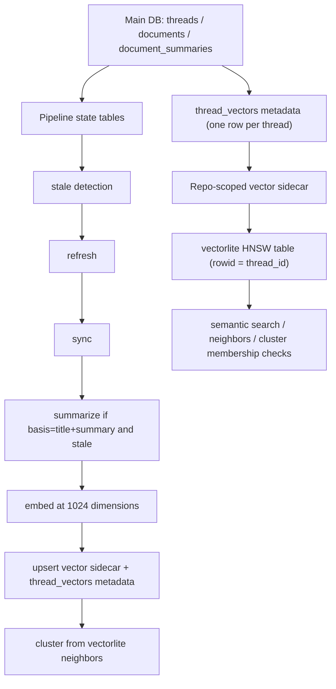
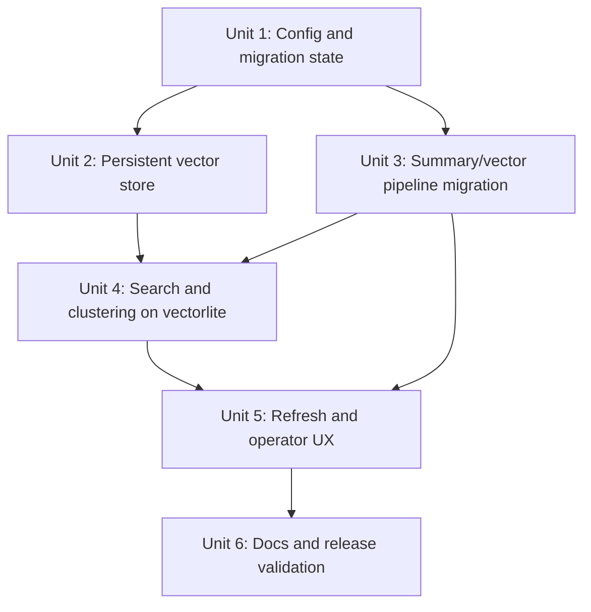

# feat: adopt persistent vectorlite search and summary-aware embedding migration

## Overview

This plan upgrades `ghcrawl` from exact in-memory embedding usage to persistent `vectorlite`-backed search and clustering, while simultaneously migrating the embedding pipeline to a single active vector per thread using `text-embedding-3-large` at 1024 dimensions. The same release also formalizes operator choice of summarization model, makes `refresh` summary-aware when the active embedding basis depends on summaries, and preserves summary skip behavior so ongoing refreshes do not become an unnecessary spend multiplier.

## Problem Frame

The current product has a split personality: the repo now has a promising `vectorlite` experiment, but production behavior still centers on `document_embeddings.embedding_json`, exact in-memory scanning, and a `refresh` pipeline that does not know how to summarize before embedding. That leaves `ghcrawl` with slow clustering on large repos, no persistent ANN search surface, stale/ambiguous upgrade behavior for old embeddings and cluster runs, and no supported operator workflow for choosing summary quality versus cost. The release needs to unify those into one supported model without making users manually recover from migration state. (see origin: `docs/brainstorms/2026-04-01-vectorlite-default-search-and-summary-migration-requirements.md`)

## Requirements Trace

- R1. Ship one coordinated breaking release for vector search, embedding migration, and summary model controls.
- R2. Make `vectorlite` a supported runtime requirement.
- R4. Maintain a persistent vector index per repository.
- R5. Query semantic search from the persistent vector index rather than exact in-memory scans.
- R6. Support fast nearest-neighbor and likely-cluster lookups for newly synced threads.
- R8. Support `gpt-5-mini` and `gpt-5.4-mini` as summary model choices.
- R9. Default summary model to `gpt-5-mini`.
- R10. Preserve skip-on-unchanged summarization behavior with tests.
- R11. Move embeddings to `text-embedding-3-large` with explicit `dimensions=1024`.
- R12. Store one active embedding per thread for the active basis.
- R13. Support operator-selectable embedding basis: title + original description or title + summarized description.
- R14. Default embedding basis to title + summarized description.
- R15. Record pipeline metadata strongly enough to detect stale summaries, vectors, and clusters deterministically.
- R17. Force pre-release embeddings to rebuild on first `refresh` after upgrade.
- R18. Make `refresh` summary-aware when the active embedding basis depends on summaries.
- R19. Treat pre-migration cluster runs as stale after upgrade.
- R23. Add `configure` to show and change active operator settings.
- R26. Make `doctor` report `vectorlite` runtime readiness.
- R27. Publish operator cost estimates for ~20k thread one-time summarization.
- R30. Add tests for summary skipping after migration.
- R31. Add tests for stale detection across model/basis/pipeline changes.
- R32. Add tests proving semantic search uses the persistent vector index.
- R34. Validate packaging/install behavior with `vectorlite` as a hard dependency.

## Scope Boundaries

- Not in scope: keeping the old exact in-memory vector path as a co-equal supported production backend.
- Not in scope: a web UI redesign or any browser surface changes.
- Not in scope: preserving old cluster runs as “current” after a repo is known to need vector migration.
- Not in scope: multi-release rollout staging for vector search, embedding migration, and summary controls.

## Context & Research

### Relevant Code and Patterns

- `packages/api-core/src/service.ts`
  - current `refreshRepository()` only runs `sync -> embed -> cluster`
  - current `summarizeRepository()` already skips unchanged work using `document_summaries.content_hash`
  - current `clusterExperiment()` contains the best existing `vectorlite` integration pattern, including extension loading and HNSW queries
  - current `searchRepository()` still builds semantic results from exact local embeddings rather than a persistent vector index
- `packages/api-core/src/openai/provider.ts`
  - already centralizes summary and embedding API calls
  - embeddings currently do not pass an explicit `dimensions` parameter
- `packages/api-core/src/config.ts`
  - already persists `summaryModel` and `embedModel`
  - does not yet expose embedding basis, vector backend state, or a first-class configuration workflow
- `packages/api-core/src/db/migrate.ts`
  - currently persists `document_summaries`, `document_embeddings`, cluster tables, and run tables
  - has no first-class pipeline-state table for migration invalidation or vector store metadata
- `apps/cli/src/main.ts`
  - already has stable command/help patterns for `doctor`, `refresh`, `search`, `neighbors`, and `cluster`
  - currently treats `summarize` as a dev-only command and has no `configure` command
- `packages/api-contract/src/contracts.ts`
  - already defines the response contracts for `doctor`, `search`, `neighbors`, and refresh results

### Institutional Learnings

- `docs/solutions/performance-issues/clustering-vectorlite-hnsw-embedding-optimization-2026-03-30.md`
  - recent internal evaluation found the strongest clustering quality from summary-oriented embeddings rather than raw title/body-only embeddings
  - `vectorlite` HNSW materially improved clustering performance on larger datasets
  - the repo’s observed summary costs support the release’s one-time migration cost messaging

### External References

- `vectorlite` README: persistent HNSW indexes can be backed by `index_file_path`, virtual tables support insert/update/delete by `rowid`, and metadata filtering is supported.
  - <https://github.com/1yefuwang1/vectorlite>
- OpenAI `text-embedding-3-large` model docs confirm the current model and pricing surface for embeddings.
  - <https://developers.openai.com/api/docs/models/text-embedding-3-large>
- OpenAI `gpt-5-mini` and `gpt-5.4-mini` model docs confirm current per-token pricing and positioning.
  - <https://developers.openai.com/api/docs/models/gpt-5-mini>
  - <https://developers.openai.com/api/docs/models/gpt-5.4-mini>

## Key Technical Decisions

- **Persistent vector storage will use a sidecar repository-scoped SQLite/vectorlite store rather than embedding vectorlite tables into the canonical main DB.**
  - Rationale: this keeps the issue/PR database as ordinary SQLite for easier rollback, inspection, and future recovery while still giving the product a durable ANN index. It also lets the vector store be rebuilt or replaced without entangling core relational data.

- **The release will introduce one active vector per thread keyed by `thread_id`, with vector bytes living in the sidecar vector store and pipeline metadata living in the main DB.**
  - Rationale: the current `document_embeddings` multi-row-per-thread model was useful for experimentation, but it is the wrong shape for “always-on” ANN search and creates unnecessary migration ambiguity.

- **`refresh` will become a four-stage pipeline in behavior: `sync -> summarize-if-needed -> embed -> cluster`, while preserving the operator mental model that `refresh` is still the one command to run.**
  - Rationale: if the active embedding basis depends on summaries, embedding can no longer be treated as independent of summarize.

- **Staleness will be managed by explicit pipeline versioning, not by ad hoc assumptions about timestamps alone.**
  - Rationale: this release changes multiple dimensions at once: summary model, summary prompt/version, embedding basis, embedding model, dimensions, and vector backend. A single pipeline compatibility stamp is easier to reason about than a loose mix of heuristics.

- **Default embedding basis will be `title + dedupe summary`; default summary model will be `gpt-5-mini`.**
  - Rationale: recent repo learnings suggest the summary-based embedding basis gives better clustering quality, while `gpt-5-mini` keeps one-time upgrade cost tolerable by default.

- **`configure` will support both read and write behavior.**
  - Rationale: `ghcrawl configure` with no mutation flags should show current settings and migration state; explicit flags should update persisted operator choices. This keeps the command useful for both humans and scripts.

## Open Questions

### Resolved During Planning

- **Where should the persistent vector index live?**
  - Resolution: in a repository-scoped sidecar vector store managed by `ghcrawl`, with the main DB retaining only relational metadata and pipeline state.

- **Should `configure` be interactive-only or scriptable?**
  - Resolution: support both. No-flag invocation shows current config and state; explicit flags mutate persisted config.

- **Should `refresh` remain unaware of summarize?**
  - Resolution: no. Summary-aware refresh is required whenever the active embedding basis depends on summaries.

### Deferred to Implementation

- **Exact sidecar path naming**
  - Decide the final on-disk naming convention during implementation, but keep it repo-scoped and colocated with existing runtime data.

- **How aggressively to scrub legacy `document_embeddings` rows**
  - The release should stop treating them as authoritative. Whether old rows are deleted immediately or left as inert historical data for one release can be finalized during implementation.

- **Whether to add a distinct “vector migration pending” status to TUI headers**
  - This is a UX refinement worth deciding while touching the TUI status code, not a blocker to planning.

## High-Level Technical Design

> *This illustrates the intended approach and is directional guidance for review, not implementation specification. The implementing agent should treat it as context, not code to reproduce.*

## Implementation Units

- [ ] **Unit 1: Add pipeline config and repo migration state**

**Goal:** Introduce durable configuration and per-repo state strong enough to drive a controlled migration instead of implicit behavior.

**Requirements:** R8, R9, R13, R15, R17, R19, R23, R26, R31

**Dependencies:** None

**Files:**
- Modify: `packages/api-core/src/config.ts`
- Modify: `packages/api-core/src/db/migrate.ts`
- Modify: `packages/api-core/src/service.ts`
- Modify: `packages/api-core/src/index.ts`
- Test: `packages/api-core/src/config.test.ts`
- Test: `packages/api-core/src/db/migrate.test.ts`
- Test: `packages/api-core/src/service.test.ts`

**Approach:**
- Extend persisted config with:
  - summary model selection
  - embedding basis selection
  - any explicit vector backend / vector store config needed for this release
- Add repo-scoped pipeline state in the main DB to record:
  - current migration compatibility version
  - active summary model / prompt version
  - active embedding basis / embedding model / dimensions
  - vector index freshness
  - cluster freshness relative to vectors
- Make stale-state computation explicit in service helpers rather than distributing it across command handlers.

**Execution note:** Start with migration-state and config tests before touching orchestration logic so later units have a stable contract to build on.

**Patterns to follow:**
- `packages/api-core/src/config.ts` persisted config loading/writing
- `packages/api-core/src/db/migrate.ts` additive schema migration style
- `packages/api-core/src/service.ts` repo-scoped run and state helpers

**Test scenarios:**
- Happy path: loading config with no new settings defaults to `gpt-5-mini` and the default embedding basis.
- Happy path: persisted config round-trips the chosen summary model and embedding basis.
- Edge case: a repo with no pipeline state is treated as migration-pending rather than current.
- Edge case: changing summary model or embedding basis marks repo vector/cluster state stale.
- Error path: malformed persisted config values are ignored or rejected consistently with current config behavior.
- Integration: startup migration on an existing pre-release DB adds the new pipeline state tables without destroying existing threads, summaries, or run history.

**Verification:**
- The config object exposes the new settings predictably.
- A migrated DB can answer “is this repo current, stale, or migration-pending?” deterministically.

- [ ] **Unit 2: Introduce a persistent vectorlite sidecar store**

**Goal:** Replace ephemeral experiment-only vectorlite usage with a supported persistent vector store abstraction.

**Requirements:** R2, R4, R5, R6, R7, R12, R15, R32, R34

**Dependencies:** Unit 1

**Files:**
- Create: `packages/api-core/src/vector/store.ts`
- Create: `packages/api-core/src/vector/vectorlite-store.ts`
- Modify: `packages/api-core/src/db/sqlite.ts`
- Modify: `packages/api-core/src/service.ts`
- Modify: `packages/api-core/src/index.ts`
- Test: `packages/api-core/src/vector/vectorlite-store.test.ts`
- Test: `packages/api-core/src/service.test.ts`

**Approach:**
- Introduce a dedicated vector-store abstraction that owns:
  - extension loading
  - sidecar file lifecycle
  - persistent HNSW virtual table creation
  - upsert/delete/query by `thread_id`
- Use a single active vector table per repo with `rowid = thread_id`.
- Keep vector values in the sidecar store rather than in the main DB as JSON.
- Keep enough metadata in the main DB to detect whether a thread’s stored vector is current without needing to inspect vector payloads.
- Make vector store open/health behavior explicit so `doctor` and runtime commands can report extension problems cleanly.

**Execution note:** Build this behind a narrow interface first; do not spread raw vectorlite SQL across service methods.

**Patterns to follow:**
- `packages/api-core/src/service.ts` current `clusterExperiment()` vectorlite extension-loading pattern
- `packages/api-core/src/db/sqlite.ts` SQLite open/pragma helpers

**Test scenarios:**
- Happy path: a vector store can create/open a repo sidecar and persist vectors across connection reopen.
- Happy path: querying nearest neighbors returns the expected thread ids after reopen, without rebuilding the index.
- Edge case: deleting a thread vector removes it from later ANN results.
- Edge case: updating an existing thread vector replaces the old vector rather than duplicating it.
- Error path: missing vectorlite extension surfaces an actionable error that `doctor` can report.
- Integration: service helpers can upsert/query/delete vectors through the abstraction without touching temp experiment paths.

**Verification:**
- A migrated repo can reopen its vector store and serve neighbor queries without loading the entire corpus into process memory.

- [ ] **Unit 3: Migrate summaries and embeddings to one active vector per thread**

**Goal:** Rebuild the content pipeline around one active vector per thread, explicit 1024-dimensional embeddings, and summary-aware stale detection.

**Requirements:** R10, R11, R12, R13, R14, R15, R16, R17, R18, R30, R31

**Dependencies:** Unit 1, Unit 2

**Files:**
- Modify: `packages/api-core/src/openai/provider.ts`
- Modify: `packages/api-core/src/service.ts`
- Modify: `packages/api-core/src/db/migrate.ts`
- Modify: `packages/api-core/src/search/exact.ts`
- Test: `packages/api-core/src/service.test.ts`
- Test: `packages/api-core/src/openai/provider.test.ts` (or add a new targeted provider/unit test file if one does not exist yet)

**Approach:**
- Add explicit embedding dimensions support to the provider and pass `dimensions=1024` for `text-embedding-3-large`.
- Replace the current multi-source embedding workset with one active vector input per thread derived from the configured basis.
- Keep summary generation as a prerequisite only when the chosen basis requires it.
- Extend summary stale detection so it remains keyed by content hash and summary model, and add any prompt/pipeline version metadata needed to invalidate old summaries intentionally.
- Add vector metadata keyed by thread id so the system can decide whether a thread needs re-embedding without reading the sidecar vector value.
- Ensure upgraded repos treat legacy vectors as stale and rebuild them on the next refresh.

**Execution note:** Characterization-first around summary skipping and embedding workset selection will reduce migration regressions here.

**Patterns to follow:**
- `packages/api-core/src/service.ts` current `summarizeRepository()` skip-on-content-hash behavior
- `packages/api-core/src/service.ts` current `embedRepository()` batching/progress patterns
- `packages/api-core/src/openai/provider.ts` retry behavior and model call centralization

**Test scenarios:**
- Happy path: unchanged summary input under the same summary model is skipped on repeated runs.
- Happy path: basis=`title+original` produces vectors without requiring summaries.
- Happy path: basis=`title+summary` triggers summarize first when dedupe summaries are missing or stale.
- Edge case: changing summary model marks summary-derived vectors stale.
- Edge case: changing embedding basis marks vectors stale even when summaries remain current.
- Edge case: pre-release `document_embeddings` rows are ignored as current vectors after migration.
- Error path: embedding provider failures do not falsely mark vectors current.
- Integration: a repo upgraded from the old schema rebuilds vectors to 1024 dimensions on first eligible refresh.

**Verification:**
- After migration, each active thread has exactly one current vector metadata row and one current sidecar vector entry for the chosen basis.

- [ ] **Unit 4: Move semantic search, neighbors, and cluster building onto vectorlite**

**Goal:** Make persistent vectorlite the supported engine for semantic lookup and cluster construction.

**Requirements:** R3, R4, R5, R6, R19, R22, R32

**Dependencies:** Unit 2, Unit 3

**Files:**
- Modify: `packages/api-core/src/service.ts`
- Modify: `packages/api-core/src/api/server.ts`
- Modify: `packages/api-core/src/cluster/build.ts`
- Modify: `packages/api-contract/src/contracts.ts`
- Test: `packages/api-core/src/service.test.ts`
- Test: `packages/api-core/src/api/server.test.ts`
- Test: `packages/api-core/src/cluster/perf.integration.ts`

**Approach:**
- Replace semantic search candidate generation with ANN neighbor lookup from the persistent vector store.
- Replace `neighbors` lookup with vector store queries rather than exact local scans.
- Rebuild cluster edge generation from vector store neighbor queries instead of loading the full embedding corpus into RAM.
- Make service methods return clear “migration pending / vectors stale / clusters stale” responses when the repo has not completed the required rebuild yet.
- Keep cluster persistence and local close-state behavior aligned with the current cluster run model unless the implementation uncovers a simpler equivalent.

**Execution note:** Start with search/neighbors characterization coverage so the ANN transition preserves the public contract while changing the engine underneath.

**Patterns to follow:**
- `packages/api-core/src/service.ts` existing `searchRepository()`, `listNeighbors()`, and cluster persistence flow
- `packages/api-contract/src/contracts.ts` current JSON contract style
- `packages/api-core/src/cluster/perf.integration.ts` current perf comparison harness

**Test scenarios:**
- Happy path: semantic search on a migrated repo returns ANN-backed hits without loading exact embeddings.
- Happy path: neighbors for a migrated thread come from the persistent vector store.
- Happy path: cluster rebuild on a migrated repo uses vectorlite and persists clusters successfully.
- Edge case: repo marked migration-pending returns a clear stale-state error or status rather than misleading old clusters.
- Edge case: closed/deleted threads are excluded from later neighbor and cluster results after vector-store cleanup.
- Integration: API server endpoints for search and neighbors continue returning valid contracts after the backend swap.
- Integration: perf harness can compare exact legacy-style behavior versus persistent vectorlite behavior on synthetic fixtures.

**Verification:**
- Semantic queries and cluster builds no longer require loading the full embedding corpus from JSON rows into process memory.

- [ ] **Unit 5: Redefine refresh and add operator configuration/health UX**

**Goal:** Make the operator experience understandable and safe during and after the migration.

**Requirements:** R17, R18, R19, R20, R21, R22, R23, R24, R25, R26, R29

**Dependencies:** Unit 1, Unit 3, Unit 4

**Files:**
- Modify: `apps/cli/src/main.ts`
- Modify: `apps/cli/src/main.test.ts`
- Modify: `apps/cli/src/init-wizard.ts`
- Modify: `apps/cli/src/tui/app.ts`
- Modify: `packages/api-core/src/service.ts`
- Modify: `packages/api-contract/src/contracts.ts`
- Test: `apps/cli/src/main.test.ts`
- Test: `packages/api-core/src/service.test.ts`

**Approach:**
- Add `ghcrawl configure`:
  - no flags: show current summary model, embedding basis, vector readiness, and migration state
  - explicit flags: change summary model and embedding basis intentionally
- Extend `doctor` to report `vectorlite` loadability and any migration readiness signals worth surfacing globally.
- Redefine `refresh` so it can automatically run summarize when the active basis requires it, while preserving the one-command operator experience.
- Update TUI status text where needed so stale vectors/clusters are visible and not mistaken for current data.
- Preserve existing spend progress messaging and expand it where the first post-upgrade refresh may trigger a large summary rebuild.

**Patterns to follow:**
- `apps/cli/src/main.ts` current command/help formatting and doctor output patterns
- `apps/cli/src/init-wizard.ts` current config write and operator guidance patterns
- `apps/cli/src/tui/app.ts` current repo status/header conventions

**Test scenarios:**
- Happy path: `configure` with no flags reports the active summary model, embedding basis, and migration status.
- Happy path: `configure` updates the summary model and persists it.
- Happy path: refresh on a migration-pending repo runs summarize before embed when basis=`title+summary`.
- Edge case: refresh on basis=`title+original` skips summarize unless the user explicitly requests summary work.
- Edge case: doctor reports vectorlite readiness failures cleanly when the extension cannot load.
- Error path: user switches summary model and is told the repo now needs rebuild work rather than being shown stale current state.
- Integration: TUI and CLI both surface repo migration/stale status consistently after settings changes.

**Verification:**
- Operators can discover current settings and complete the first migration refresh without consulting source code or guessing which hidden command to run.

- [ ] **Unit 6: Update docs, release notes, and upgrade validation**

**Goal:** Make the release understandable to operators and safe to ship.

**Requirements:** R1, R27, R28, R29, R33, R34

**Dependencies:** Units 1-5

**Files:**
- Modify: `README.md`
- Modify: `apps/cli/README.md`
- Modify: `CONTRIBUTING.md`
- Modify: `docs/DESIGN.md`
- Modify: `docs/PLAN.md`
- Modify: `.github/workflows/ci.yml`
- Modify: `.github/workflows/publish.yml` (if packaging validation needs to change)
- Test: `packages/api-core/src/cluster/perf.integration.ts`
- Test expectation: none -- docs files themselves do not need behavioral tests, but the release validation steps must be represented in automated checks where practical

**Approach:**
- Update operator docs to explain:
  - `vectorlite` is now required
  - first refresh after upgrade may trigger a one-time rebuild
  - `gpt-5-mini` vs `gpt-5.4-mini` tradeoffs and costs
  - semantic search now depends on the persistent vector index
- Publish a concrete upgrade story for pre-vectorlite users.
- Extend CI/package validation enough to catch missing `vectorlite` packaging or install regressions on supported platforms.
- Preserve or refine the existing cluster perf workflow so future PRs can still compare the vector path meaningfully.

**Patterns to follow:**
- current README operator sections
- current CI/package smoke workflows
- current cluster perf workflow/comment structure

**Test scenarios:**
- Happy path: package smoke or install validation confirms `vectorlite` is present and the CLI still launches on supported platforms.
- Edge case: upgrade validation from a pre-vectorlite DB shows first refresh drives the required rebuild path without manual DB surgery.
- Integration: CI continues to publish meaningful cluster perf comparisons after the migration lands.

**Verification:**
- A maintainer can follow the docs to understand migration cost, migration steps, and expected behavior on first refresh.

## System-Wide Impact

- **Interaction graph:** `sync`, `summarize`, `embed`, `search`, `neighbors`, `cluster`, `refresh`, `doctor`, `configure`, TUI status surfaces, and package/install flows all participate in this release.
- **Error propagation:** vector store open/load failures must surface as health/configuration errors, not as silent empty search results.
- **State lifecycle risks:** the main DB and vector sidecar must stay logically synchronized when threads close, content changes, configs change, or refresh is interrupted mid-run.
- **API surface parity:** CLI and local HTTP API should report migration state consistently for search- and cluster-dependent commands.
- **Integration coverage:** upgrade-from-old-DB scenarios, vector store reopen scenarios, and refresh-after-setting-change scenarios need integration coverage beyond isolated unit tests.
- **Unchanged invariants:** GitHub sync remains the source of truth for thread metadata and local close-state behavior remains intact; this plan changes vector/search infrastructure, not the core sync contract.

## Risks & Dependencies

| Risk | Mitigation |
|------|------------|
| `vectorlite` native packaging breaks on one or more supported platforms | Add package smoke and install validation, surface `doctor` readiness clearly, and keep sidecar/vector-store code isolated so failures are diagnosable |
| Old cluster runs appear current after upgrade | Add explicit repo pipeline state and invalidate cluster freshness when pipeline compatibility changes |
| Summary-derived embedding migration silently re-summarizes too much and causes unnecessary spend | Preserve content-hash-based skipping, add model/basis-aware stale detection, and keep spend progress reporting visible during summarize/refresh |
| Main DB and vector sidecar drift out of sync | Centralize vector upsert/delete through one abstraction and update pipeline state only after successful writes |
| Search quality regresses if vectorlite and summary-basis defaults are not aligned with current learnings | Use the recent internal clustering solution doc as the default rationale and keep perf/quality comparison harnesses intact |

## Documentation / Operational Notes

- Document the one-time cost estimate for ~20k-thread full summarization with both summary models.
- Document that the first post-upgrade refresh may take meaningfully longer than future refreshes because it performs migration work.
- Document that semantic search and nearest-neighbor features are only trustworthy after repo migration completes.
- Include a short maintainer release note calling out the breaking nature of the vector/search migration.

## Sources & References

- **Origin document:** `docs/brainstorms/2026-04-01-vectorlite-default-search-and-summary-migration-requirements.md`
- Related code:
  - `packages/api-core/src/service.ts`
  - `packages/api-core/src/openai/provider.ts`
  - `packages/api-core/src/config.ts`
  - `packages/api-core/src/db/migrate.ts`
  - `packages/api-contract/src/contracts.ts`
  - `apps/cli/src/main.ts`
- Institutional learning:
  - `docs/solutions/performance-issues/clustering-vectorlite-hnsw-embedding-optimization-2026-03-30.md`
- External docs:
  - <https://github.com/1yefuwang1/vectorlite>
  - <https://developers.openai.com/api/docs/models/text-embedding-3-large>
  - <https://developers.openai.com/api/docs/models/gpt-5-mini>
  - <https://developers.openai.com/api/docs/models/gpt-5.4-mini>
